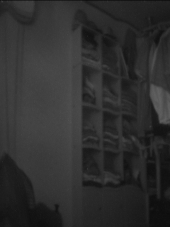


# OV7670 + arduino uno

## 튜토리얼
* 한글 : http://arduino-makers.tistory.com/68

* 영문 : http://www.instructables.com/id/OV7670-Without-FIFO-Very-Simple-Framecapture-With-/

## 주요 사항
위 튜토리얼데로 진행 하면 되지만
와이어 연결은 https://cdn.instructables.com/FH9/WIED/IZYGGNLH/FH9WIEDIZYGGNLH.LARGE.jpg 로 진행

** 영문 튜토리얼 사이트의 吳喜舒 님 주요 댓글 ** 

> XCLK>D11 directly (don't use any resistance)

> if you keep stop in "looking for image"
Switch SIOC>D4 /SIOD>D5 OR SIOC>D5/SIOC>D4

## 조립 결과

## 카메라 결과

